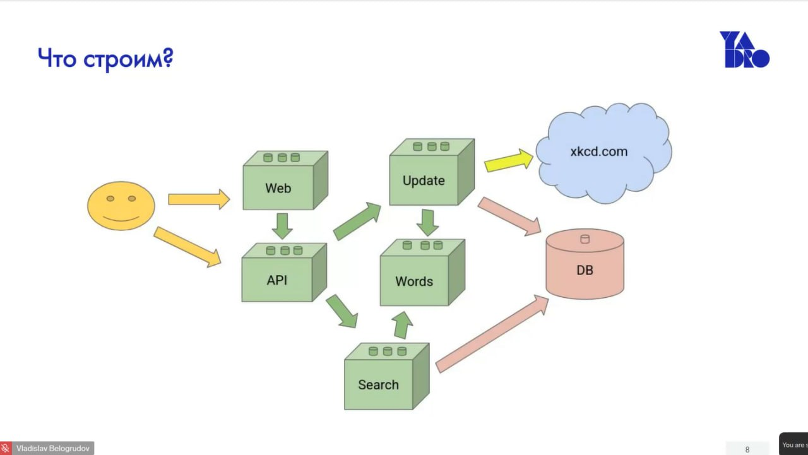

# XKCD Search Service

Микросервисная система для поиска комиксов XKCD с использованием PostgreSQL, gRPC, NATS и веб-интерфейса.

## Описание

Система состоит из нескольких микросервисов, которые работают вместе для предоставления функционала поиска комиксов XKCD:

- **API Gateway** - REST API шлюз для взаимодействия с клиентами
- **Update Service** - сервис для загрузки и обновления комиксов из XKCD API
- **Search Service** - сервис для поиска комиксов по базе данных и индексу
- **Words Service** - сервис для нормализации и обработки текста (стемминг, удаление стоп-слов)
- **Frontend** - веб-интерфейс для работы с системой

## Архитектура

Проект использует архитектуру **Ports & Adapters** (Hexagonal Architecture), которая обеспечивает:
- Разделение бизнес-логики и инфраструктуры
- Легкое тестирование через моки
- Гибкость в выборе технологий



*Диаграмма архитектуры системы XKCD Search Service*

### Потоки данных

```
┌──────────────┐
│ Пользователь │
└────┬─────────┘
     │
     ├──────────────┐
     │              │
┌────▼────┐    ┌────▼────┐
│   Web   │    │   API   │
│(Frontend)│    │ Gateway │
└────┬────┘    └────┬────┘
     │              │
     └──────┬───────┘
            │ HTTP
     ┌──────▼──────┐
     │  API Gateway │
     └──┬───────┬───┘
        │       │
        │ gRPC  │ gRPC
        │       │
   ┌────▼───┐ ┌─▼────┐
   │ Search │ │Update│
   └───┬────┘ └─┬────┘
       │        │
       │        ├──────────────┐
       │        │              │
       │    ┌───▼───┐    ┌─────▼────┐
       │    │ Words │    │ xkcd.com │
       │    └───┬───┘    └──────────┘
       │        │
       │        │ (обработанные слова)
       │        │
   ┌───▼────────▼───┐
   │   PostgreSQL   │
   └────────────────┘
            │
   ┌────────▼────────┐
   │  NATS (events)  │
   └─────────────────┘
```

### Описание потоков

1. **Пользователь → Web/API**
   - Пользователь может взаимодействовать через веб-интерфейс или напрямую через API
   - Веб-интерфейс использует API для всех операций

2. **API Gateway → Search Service**
   - API Gateway получает запросы на поиск
   - Перенаправляет их в Search Service через gRPC

3. **Update Service → xkcd.com**
   - Update Service загружает комиксы с внешнего API xkcd.com
   - Обрабатывает данные и сохраняет в базу

4. **Update Service → Words Service**
   - Update Service отправляет текст комиксов в Words Service
   - Words Service нормализует и обрабатывает текст (стемминг, удаление стоп-слов)

5. **Update Service → Database**
   - Update Service сохраняет комиксы и ключевые слова в PostgreSQL
   - Публикует события обновления в NATS

6. **Words Service → Search Service**
   - Words Service обрабатывает поисковые запросы
   - Нормализует фразы для поиска

7. **Search Service → Database**
   - Search Service читает данные из PostgreSQL
   - Использует индекс для быстрого поиска

8. **Update Service → NATS → Search Service**
   - При обновлении базы Update Service публикует событие в NATS
   - Search Service подписывается на события и перестраивает индекс

## Микросервисы

### API Gateway (`api`)
- REST API для клиентов
- Аутентификация через JWT токены
- Rate limiting и concurrency limiting
- Проксирование запросов к другим сервисам через gRPC

**Порты:** `28080` (HTTP)

### Update Service (`update`)
- Загрузка комиксов с XKCD API
- Сохранение в PostgreSQL
- Публикация событий обновления в NATS
- Статистика базы данных

**Порты:** `28082` (gRPC)

### Search Service (`search`)
- Поиск комиксов по базе данных
- Индексный поиск для быстрого поиска
- Подписка на события обновления через NATS
- Автоматическое перестроение индекса

**Порты:** `28083` (gRPC)

### Words Service (`words`)
- Нормализация текста (приведение к нижнему регистру)
- Удаление стоп-слов
- Стемминг слов

**Порты:** `28081` (gRPC)

### Frontend
- Веб-интерфейс для работы с системой
- Авторизация
- Поиск комиксов
- Просмотр статистики
- Администрирование

**Порты:** `8080` (HTTP)

## Быстрый старт

### Требования

- Docker и Docker Compose (или Podman)
- Make
- Go 1.25+ (для разработки)

### Запуск системы

1. **Запустить все сервисы:**
   ```bash
   make up
   ```

2. **Открыть веб-интерфейс:**
   - Frontend: http://localhost:8080
   - API: http://localhost:28080
   - PgAdmin: http://localhost:18888

3. **Остановить систему:**
   ```bash
   make down
   ```

4. **Очистить все данные (включая volumes):**
   ```bash
   make clean
   ```

## API Документация

Полная документация API доступна в формате OpenAPI 3.0 (Swagger):
- **Файл:** [docs/swagger.yaml](docs/swagger.yaml)

### Просмотр документации

Для просмотра интерактивной документации:

1. **Swagger Editor (онлайн):**
   - Откройте https://editor.swagger.io/
   - Скопируйте содержимое `docs/swagger.yaml`
   - Вставьте в редактор

2. **Swagger UI (локально):**
   ```bash
   docker run -p 8081:8080 -e SWAGGER_JSON=/docs/swagger.yaml -v $(pwd)/docs:/docs swaggerapi/swagger-ui
   ```
   Затем откройте http://localhost:8081

3. **VS Code:**
   - Установите расширение "OpenAPI (Swagger) Editor"
   - Откройте `docs/swagger.yaml`

Документация включает:
- Все API endpoints с описаниями
- Схемы запросов и ответов
- Примеры использования
- Описание аутентификации
- Коды ошибок и их значения

## API Endpoints

### Авторизация

**POST** `/api/login`
```json
{
  "name": "admin",
  "password": "password"
}
```
**Ответ:** токен (строка)

### Поиск

**GET** `/api/search?phrase=linux&limit=10`
- Обычный поиск по базе данных
- Защищен concurrency limiter

**GET** `/api/isearch?phrase=linux&limit=10`
- Индексный поиск (быстрый)
- Защищен rate limiter

**Ответ:**
```json
{
  "comics": [
    {
      "id": 196,
      "url": "https://imgs.xkcd.com/comics/command_line_fu.png"
    }
  ],
  "total": 1
}
```

### Статистика и статус

**GET** `/api/ping`
- Проверка статуса всех сервисов

**GET** `/api/db/stats`
- Статистика базы данных

**GET** `/api/db/status`
- Статус процесса обновления

### Администрирование (требует авторизацию)

**POST** `/api/db/update`
- Запуск обновления базы данных
- Header: `Authorization: Token <токен>`

**DELETE** `/api/db`
- Очистка базы данных
- Header: `Authorization: Token <токен>`

## Конфигурация

Все сервисы конфигурируются через:
- Файлы `config.yaml` в каждой директории сервиса
- Переменные окружения (приоритет выше)

### Основные переменные окружения

**API Gateway:**
- `ADMIN_USER` - имя администратора (по умолчанию: `admin`)
- `ADMIN_PASSWORD` - пароль администратора (по умолчанию: `password`)
- `TOKEN_TTL` - время жизни токена (по умолчанию: `2m`)
- `SEARCH_CONCURRENCY` - лимит одновременных запросов к `/api/search` (по умолчанию: `10`)
- `SEARCH_RATE` - RPS для `/api/isearch` (по умолчанию: `100`)

**Update Service:**
- `DB_ADDRESS` - адрес PostgreSQL
- `XKCD_URL` - URL XKCD API
- `XKCD_CONCURRENCY` - количество параллельных загрузок
- `BROKER_ADDRESS` - адрес NATS сервера
- `TOPIC` - топик для публикации событий

**Search Service:**
- `DB_ADDRESS` - адрес PostgreSQL
- `WORDS_ADDRESS` - адрес Words сервиса
- `BROKER_ADDRESS` - адрес NATS сервиса
- `INDEX_TTL` - время жизни индекса (по умолчанию: `24h`)

## Разработка

### Структура проекта

```
task9/
├── compose.yaml              # Docker Compose конфигурация
├── Makefile                  # Основные команды
├── frontend/                 # Веб-интерфейс
│   ├── index.html
│   ├── app.js
│   ├── style.css
│   └── nginx.conf
├── search-services/          # Go микросервисы
│   ├── api/                  # API Gateway
│   ├── update/              # Update Service
│   ├── search/               # Search Service
│   ├── words/                # Words Service
│   ├── proto/                # Protobuf определения
│   └── Makefile
└── tests/                    # Интеграционные тесты
```

### Генерация Protobuf

```bash
make proto
```

### Линтинг

```bash
make lint
```

### Модульные тесты

```bash
make unit
```

После выполнения тестов будет создан файл `cover.html` с отчетом о покрытии кода.

**Требования:**
- Каждый файл должен быть покрыт тестами минимум на 50%
- Автосгенерированные файлы не покрываются тестами

### Интеграционные тесты

```bash
make test
```

Эта команда:
1. Очищает окружение
2. Запускает все сервисы
3. Ждет 10 секунд для инициализации
4. Запускает интеграционные тесты
5. Очищает окружение

## Тестирование

### Модульные тесты

Модульные тесты используют моки для изоляции компонентов:
- Моки для gRPC клиентов
- Моки для базы данных (sqlx)
- Моки для NATS соединений
- Моки для HTTP клиентов

**Запуск:**
```bash
make unit
```

### Интеграционные тесты

Интеграционные тесты проверяют работу всей системы:
- Проверка всех API endpoints
- Проверка middleware (auth, rate limit, concurrency)
- Проверка взаимодействия между сервисами

**Запуск:**
```bash
make test
```

## Веб-интерфейс

Веб-интерфейс доступен на `http://localhost:8080` после запуска системы.

### Функциональность

- **Авторизация** - вход в систему с токеном
- **Поиск комиксов** - обычный и индексный поиск
- **Статистика** - просмотр статистики базы данных
- **Администрирование** - запуск обновления и очистка БД
- **Мониторинг** - проверка статуса всех сервисов

### Учетные данные по умолчанию

- Имя пользователя: `admin`
- Пароль: `password`

## База данных

Система использует PostgreSQL для хранения:
- Комиксов (ID, URL, ключевые слова)
- Индекса поиска (слова → комиксы)

### Миграции

Миграции выполняются автоматически при запуске Update сервиса.

### PgAdmin

PgAdmin доступен на `http://localhost:18888`:
- Email: `admin@test.com`
- Пароль: `password`

## События (NATS)

Система использует NATS для событийного управления:

- **Update Service** публикует события при обновлении базы данных
- **Search Service** подписывается на события и перестраивает индекс

Топик по умолчанию: `xkcd.db.updated`

## Особенности реализации

### Rate Limiting

- `/api/search` - concurrency limiter (максимум одновременных запросов)
- `/api/isearch` - rate limiter (запросов в секунду)

### Аутентификация

- JWT токены с временем жизни
- Middleware для проверки токенов
- Защита критических операций (обновление, удаление БД)

### Индексация

- Автоматическое построение индекса при старте
- Перестроение индекса по событиям от Update сервиса
- TTL для индекса (24 часа)

## Troubleshooting

### Сервисы не запускаются

1. Проверьте, что порты не заняты
2. Проверьте логи: `docker compose logs <service_name>`
3. Убедитесь, что PostgreSQL готов: `docker compose ps`

### Тесты не проходят

1. Убедитесь, что все сервисы запущены: `make up`
2. Подождите инициализации (10+ секунд)
3. Проверьте логи тестового контейнера

### Фронтенд не работает

1. Проверьте, что API доступен: `curl http://localhost:28080/api/ping`
2. Откройте консоль браузера (F12) для отладки
3. Проверьте логи nginx: `docker compose logs frontend`

## Лицензия

Учебный проект YADRO.
